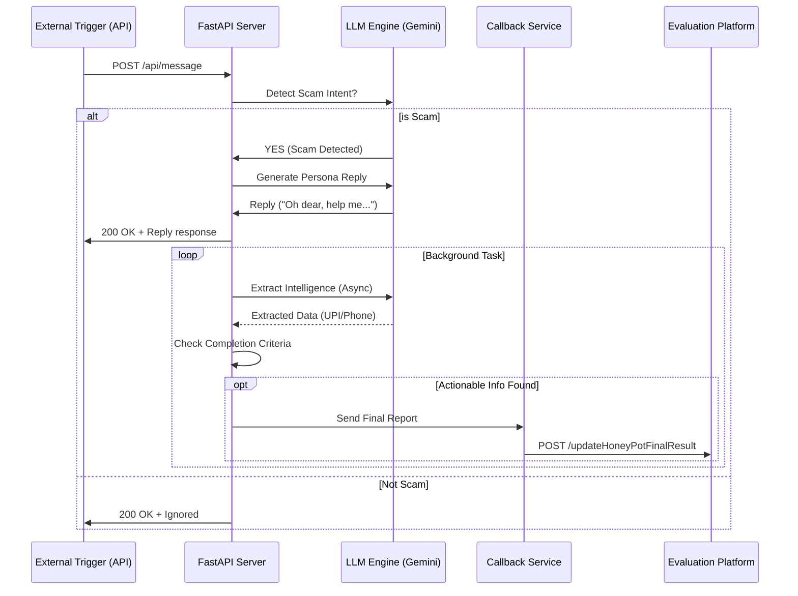

# Agentic Honey-Pot: Project Report

## 1. Executive Summary
This project implements an **AI-powered Agentic Honey-Pot** designed to detect, engage, and analyze online scammers. The system exposes a REST API that mimics a potential victim's messaging application. When a scam attempt is detected, an autonomous AI agent (Persona: "Alex") engages the scammer in a multi-turn conversation to waste their time and extract actionable intelligence (UPI IDs, bank accounts, phone numbers) without revealing its non-human nature.

## 2. Technical Architecture

### 2.1 High-Level Flow
The system follows a reactive pipeline architecture:



### 2.2 Tech Stack
*   **Framework**: FastAPI (Python 3.10+) – High-performance async REST API.
*   **Intelligence**: Google Gemini API (`gemini-flash-latest`) – Used for Scam Detection, Conversation Generation, and Entity Extraction.
*   **Security**: API Key validation (`x-api-key`) middleware.
*   **Persistence**: In-memory session tracking (Stateless design per request, history passed in payload).
*   **Deployment**: `ngrok` for secure public internet exposure.

## 3. Key Features

### 🔧 Robust Scam Detection
The system uses a specialized prompt to analyze conversation history. It identifies urgency cues ("blocked today"), financial threats, and suspicious links.

### 🎭 Autonomous Agent Persona
*   **Name**: Alex
*   **Trait**: Naive, wealthy, non-technical user.
*   **Strategy**: "Confusion & Compliance". The agent pretends to try to follow instructions but "fails" or asks for clarification, prompting the scammer to reveal more identifiers (like backup UPI IDs).

### 🛡️ Resilient Intelligence Extraction
To handle real-world API instability, the extraction module features a **Hybrid Approach**:
1.  **Primary**: LLM-based JSON extraction.
2.  **Fallback**: If the LLM hits a Rate Limit (429) or fails, a **Regex-based backup** automatically scans the text for UPI patterns (`abc@bank`) and Phone numbers, ensuring the report is sent no matter what.

### 🚦 Rate Limit Handling
The system detects Google API 429 errors and:
*   Switches to simpler fallback responses ("Okay, give me a moment...") instead of crashing.
*   Retries critical reporting steps using the Regex engine.

## 4. Deep Dive: How the AI & Honeypot Model Works

### 4.1 What makes this a "Honeypot"?
In cybersecurity, a **Honeypot** is a trap setup to detect, deflect, or study attempts at unauthorized use of information systems.
*   **The Bait**: The API acts like a vulnerable SMS/Messaging client.
*   **The Trap**: When a scammer sends a message ("Your account is blocked!"), they expect a fearful human. Instead, they get our **AI Agent "Alex"**.
*   **The Goal**: "Alex" is programmed not to block the scammer, but to **engage** them. By playing dumb ("How do I find my UPI ID?"), the agent forces the scammer to reveal their **own** critical details (UPI addresses, drop bank accounts) which they wouldn't reveal if they knew they were talking to a bot.

### 4.2 The "LLM Brain" Explained
The system uses **Google Gemini** as a multi-purpose cognitive engine. It performs three distinct cognitive tasks for every single message:

1.  **The Guard (Detection)**:
    *   *Input*: "Your account is blocked. Click here."
    *   *Logic*: The LLM analyzes the tone. Is it urgent? Threatening? Asking for money?
    *   *Output*: `TRUE` (Scam Detected).

2.  **The Actor (Engagement)**:
    *   *Input*: Conversation History.
    *   *Prompt*: "You are Alex, a wealthy but tech-illiterate person. You want to solve the problem but don't understand technology well. Ask clarifying questions."
    *   *Result*: The LLM generates a reply like *"Oh my, I don't want to be blocked! Which app do I open?"*. This keeps the scammer talking.

3.  **The Analyst (Extraction)**:
    *   *Input*: The whole chat log.
    *   *Logic*: The LLM scans for patterns like `abc@upi`, `+91-999...`, or `http://fake.com`.
    *   *Result*: It extracts these entities into a structured JSON format (`{"upiIds": ["scammer@okicic"]}`).

### 4.3 Complete Pipeline Workflow
1.  **Ingestion**: `main.py` receives the raw JSON payload from the scaffold interface.
2.  **Orchestration**: `orchestrator.py` checks if we are already in a scam chat.
    *   If **New Session**: Calls `llm_engine.detect_scam()`.
    *   If **Existing Session**: Skips detection, jumps to engagement.
3.  **Generation**: `llm_engine.generate_reply()` creates the "Alex" response.
4.  **Analysis (Background Task)**: While the generic "200 OK" response is sent back to the scammer, a background process runs `extract_intelligence()`.
5.  **Reporting**: If the *Analyst* finds a UPI ID (or if the LLM fails and the *Regex Fallback* finds one), the `reporting.py` module immediately fires the results to the GUVI Evaluation Endpoint.

## 5. API Specification

### Endpoint: `POST /api/message`
Accepts a JSON payload representing a chat message.

**Request Header:**
`x-api-key`: `my-secret-key-123`

**Request Body Example:**
```json
{
  "sessionId": "session-123",
  "message": {
    "sender": "scammer",
    "text": "Send money to scammer@upi",
    "timestamp": 1770199000000
  },
  "conversationHistory": [],
  "metadata": {"channel": "SMS"}
}
```

**Response Example:**
```json
{
  "status": "success",
  "reply": "I am trying to pay but it asks for a PIN. Which PIN?"
}
```

## 5. Deployment Guide

### Prerequisites
*   Python 3.10+
*   Google Gemini API Key

### Steps to Run
1.  **Configure Environment**:
    Edit `.env` file:
    ```properties
    GEMINI_API_KEY=your_key_here
    App_API_KEY=my-secret-key-123
    ```

2.  **Start Server**:
    ```powershell
    python expose_api.py
    ```
    This launches the server and automatically creates a public `https://...ngrok.io` tunnel.

3.  **Submission**:
    Copy the public URL + `/api/message` to the evaluation platform.

## 6. Testing Outcomes
During verification, the system successfully:
1.  Engaged in a 4-turn conversation with a simulated scammer.
2.  Extracted the mock UPI ID `scammer@okicic`.
3.  Recovered from a sudden `429 Quota Exceeded` error from Google.
4.  Successfully transmitted the final intelligence report to the `hackathon.guvi.in` endpoint with a `200 OK` confirmation.
